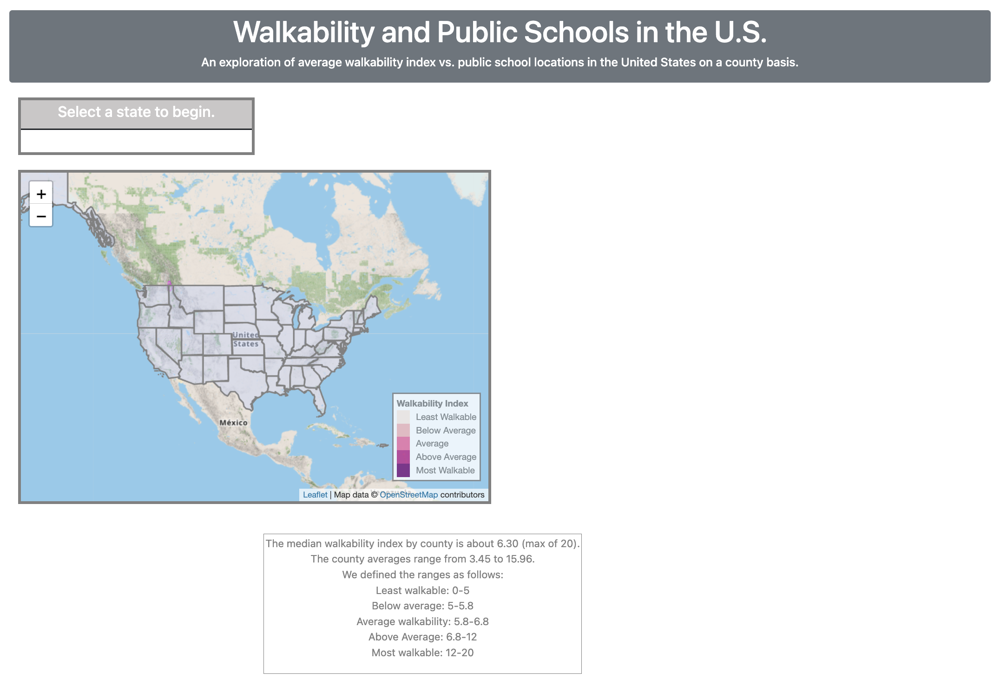
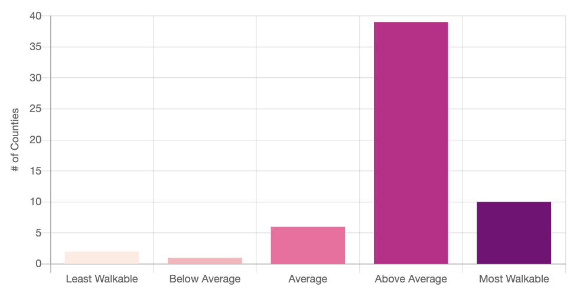

# Walkability and Public School Locations in the United States

### Project 3 Group 4

## Project Background

For this project we used the [Walkability Index](https://catalog.data.gov/dataset/walkability-index) data combined with [NCES Public School location](https://data-nces.opendata.arcgis.com/datasets/nces::public-school-locations-current-1/about) API to explore walkability vs. public school locations by county within the United States.  The goal was determine the number of students and schools within each county and examine the average walkability score with respect to the relative student population, calculated as a percent of the total county population. We aimed to analyze these two datasets to hopefully provide more insight into identifying potential "problem areas" - areas with low walkability ratings but higher amounts of students and schools.

The Walkability Index dataset characterizes every Census 2019 block group in the U.S. based on its relative walkability. Walkability depends upon characteristics of the built environment that influence the likelihood of walking being used as a mode of travel. The Walkability Index is based on the EPA's previous data product, the Smart Location Database (SLD).

The Public School Locations dataset was used to display markers and marker cluster groups for all public school locations in the United States on an interactive map.

## Solution Approach
- The following data sets, tools, programming languages and libraries were used for this project: 

1. Data: Walkability Index dataset, Public School Locations dataset, state and county GeoJSON files
2. Cleaned data was inserted into the properties of our county geoJSON and inserted into Mongo Atlas
3. Flask app was used with Render to make a call to the Mongo Atlas DB, allowing access to our custom GeoJSON for API calls.
4. Used HTML for framework of web page with CSS, Bootstrap, and JavaScript
5. Javascript file connects to GeoJSON API and Public School Locations API via D3 to pull data and dynamically create/add map overlays, update panel info, and update charts for visualizing the data
6. Leaflet to create the interactive map to display state boundaries, zoom to fit selected state, create and add interactive county choropleth layer for selected state, and create/add marker clusters only within bounds of the selected state or county
7. Chart.js library to create the scatter plot and Plotly library for the bar chart visualizations

## Functionality

The webpage is hosted on [GitHub Pages](https://t1me2.github.io/Project3_Group4/).
Loading the webpage will show the interactive map with a legend, and prompt the user to begin by selecting a state. The code for all Javascript functionality is contained in the [logic.js](./static/js/logic.js) file, with functions for creating the scatter and bar visualizations contained in the [charts.js](./static/js/logic.js) file. Further information regarding the walkability index ranges is displayed in a box at the bottom of the page. The page is responsive to varying screen sizes, and at small sizes will display the panel, map, charts, and additional info in a single column.

 

The base map is a tile from [CyclOSM](https://www.cyclosm.org/#map=12/52.3728/4.8936/cyclosm), which displays information including bicycle and highway infrastructure
Hovering over a state will highlight it in a different color. When the user clicks on a state, the map zooms to fit the bounds of the selected state and creates a new marker cluster layer of all public school locations, as well as an interactive county choropleth layer that shows all counties in the state. The colors are divided into five ranges, named 'Least Walkable' (0-5), 'Below Average' (5-5.8), 'Average' (5.8-6.8), 'Above Average' (6.8-12), and 'Most Walkable' (12-20). These ranges were determined by first identifying the minimum score (3.45), maximum score (15.95), and median score (6.3). The 1st quartile is just over 5 and the 3rd quartile is around 8.2. Some ranges were slightly adjusted for better contrast in visuals.

A scatter plot comparing walkability and student percent of the total population by county (for the selected state) is created and displayed on the webpage, as well as a bar chart showing the number of counties in each walkability range category. The color of the points corresponds to that county's walkability index, and hovering over points on the scatter plot displays the name of that particular county.

The below screenshots display closeups of the plots for California, which seems to be one of the more walkable states.

 

The information panel also displays the full name of the selected state and displays the total number of schools in the state. The user is then prompted to select a county for more information.

 

Selecting a county then zooms again to fit the county, highlights the county to match its walkability range, displays the marker cluster layer for all school locations within its boundaries, and reduces the fill opacity so the user can more easily see the geographic features of the map. The bar chart and scatter plot remain the same. Each individual marker displays a pop-up containing the school's name, city, and state, when clicked.

The screenshot directly below shows the updated panel and map for Marion County in Florida. The info panel shows that the total number of 65 schools are in Marion County with a walkability score of 7.35 and student population of 41,177 or 11.82% of the total.

## Future Considerations

We initially set out to create a tool for identifying "problem areas" and displaying them on a map. Given more time, we would like to extend this project in the following ways:
- Sort the data in our county API to identify most walkable and least walkable counties within each state.
- Incorporate school density (schools per square mile or schools per capita) into our county API to more easily identify high density school areas.
- Calculate the ratio for a county's school density divided by its average walkability index and use this to create a new choropleth map identifying areas with lower walkability and higher school counts or student populations.
- Include more specific public school data to explore relationships between walkability and certain school characteristics, for example percent of students eligible for free/reduced lunch.

**Reference:**
- [Chart.js](https://www.chartjs.org/)
- [Walkability Index](https://catalog.data.gov/dataset/walkability-index)
- [Leaflet](https://leafletjs.com/examples/choropleth/)
- [MongoBD](https://www.mongodb.com/)
- [Bootstrap](https://getbootstrap.com/)
- [JavaScript](https://htmlcheatsheet.com/js/)
- [D3/API](https://d3js.org/)

**Project Team Members:** 
* Jack Miller: Email: jmiller10@css.edu
* Nicholas Erdos-Thayer: Email: erdos.thayer@gmail.com
* Cherno Jallow: Email: cjallow@hotmail.com
* Glen Dagger: Email: glendagger@gmail.com